# Selarium

> *A ritual-magic mod for Minecraft 1.20.1 (Forge): draw sigils, feed them dust and mana, and raise wards that act on an area.*

Selarium é um mod de **magia ritual**. Você desenha **sigilos** no chão com poeira arcana, alimenta-os com **poeiras** refinadas
de cristais de geodo e com **mana**, e ativa **proteções (wards)** — barreiras e campos que aplicam efeitos numa
**área** ao redor do sigilo (uma esfera de efeito, mostrada como uma cúpula de cristal facetada): curar aliados,
expulsar invasores, acelerar plantações, prender projéteis, levantar muralhas temporárias…

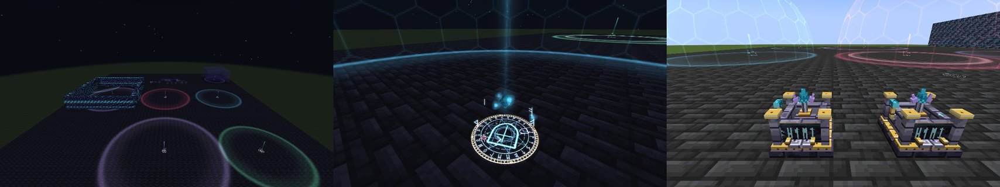

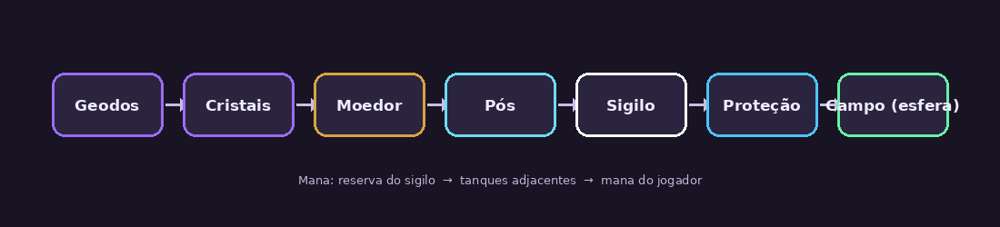

## Destaques

- **32 proteções** em 7 categorias (fonte de mana, detecção, benefícios, utilidades, efeitos hostis, estruturas, eventos) —
  veja a [referência completa](docs/WARDS.md).
- **Nada é redondo**: a identidade visual é angular. Giz desenhado à mão (um decágono irregular), anéis de luz que são
  polígonos, glifos feitos de facetas, geodos irregulares e facetados e uma **cúpula de cristal** no lugar da esfera lisa.
- **Sigilo vivo**: marcas por tipo de poeira, glifo próprio de cada proteção e, ao ativar, anéis de luz giratórios,
  runas em órbita, um cristal-foco flutuante e a **cúpula do campo**, com o contorno rúnico no chão, mostrando onde a
  proteção age.
- **Partículas próprias** (fagulhas em estrela, pipas de luz, runas e um anel octogonal que varre o chão a cada ciclo)
  enviadas pelo servidor com a cor da proteção.
- **Máquinas modeladas em 3D**: Moedor Arcano (estado *ligado* com runas acesas), Tanque de Mana com fluido animado,
  Bancada de Inscrição, cristais facetados em 4 estágios de crescimento, livros e pergaminhos 3D.
- **Progressão por mana**: mana do jogador, limites que crescem por marcos, pergaminhos de sintonização e de proteção
  (o selo do pergaminho ganha a cor da proteção).
- **Grimório de Wards**: regras por jogador, por categoria de criatura e por proteção.
- **Mundo**: geodos arcanos com cristais que crescem, árvore arcana com pétalas.
- Idiomas: **Português (Brasil)** e **English**.

## Galeria

Capturas reais do jogo, tiradas automaticamente pelo CI (o cliente roda com renderização por software em 854×480;
numa GPU o resultado é mais nítido e fluido).

| | |
|---|---|
| 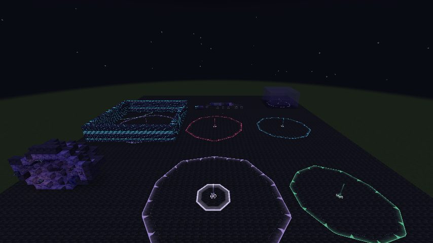<br>*Cinco campos ativos à noite: cada proteção tem a sua cor e o seu estilo de casca.* | 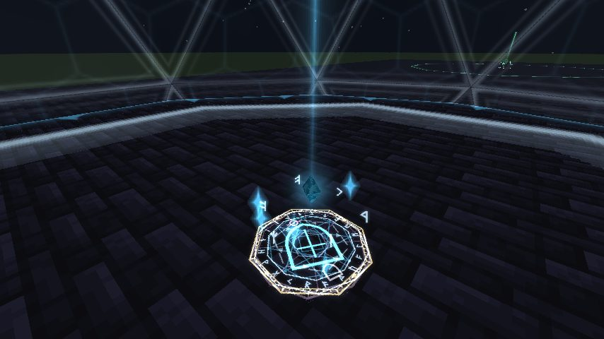<br>*O sigilo ativo: círculo de giz, glifo, anéis de luz, cristal-foco e coluna de luz.* |
| 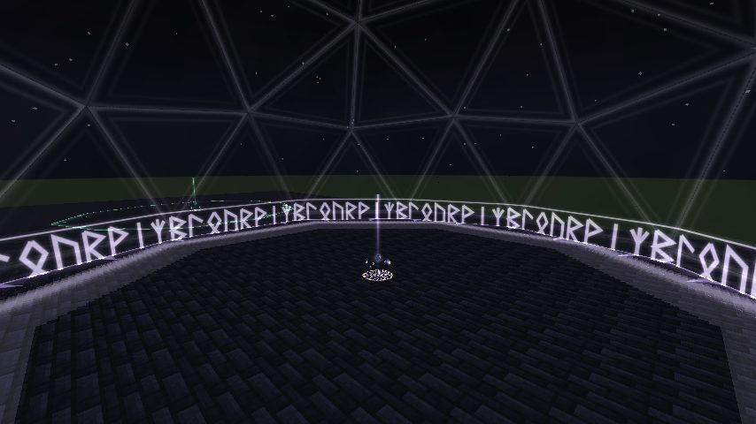<br>*Casca de runas (Ward Sussurrante).* | 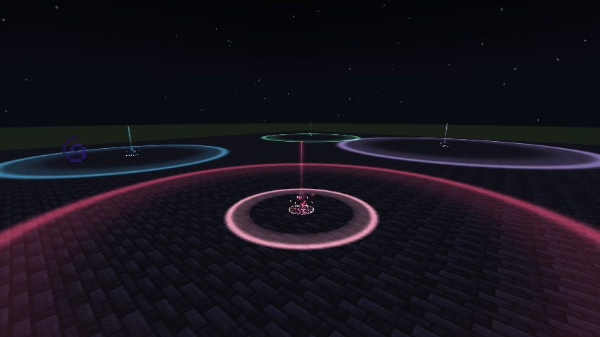<br>*Campo hostil (Banimento): um anel varre o chão a cada ciclo.* |
| 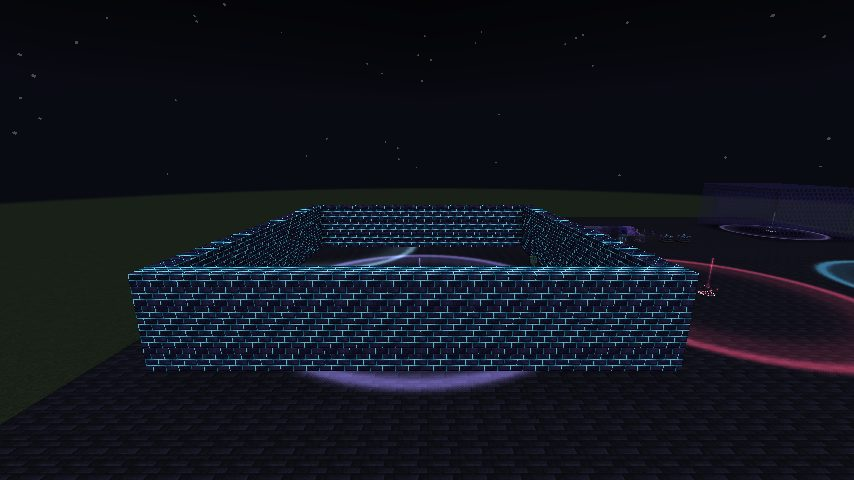<br>*Muralha da Cidadela: as juntas brilham no escuro.* | 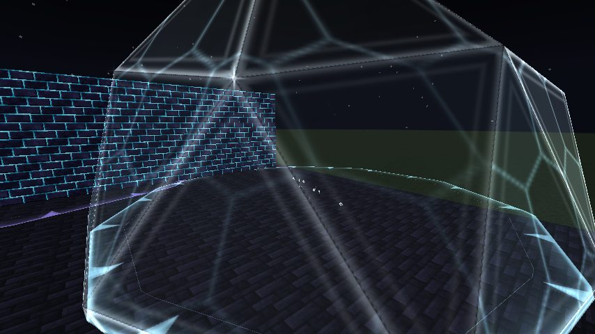<br>*Campo de pergaminho (sem block entity), com a muralha ao fundo.* |
| 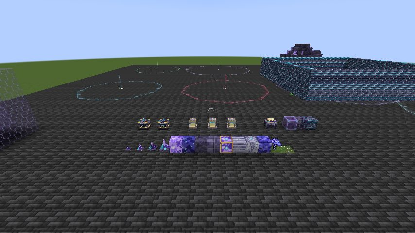<br>*Moedores Arcanos, parado e ligado (runas acesas).* | 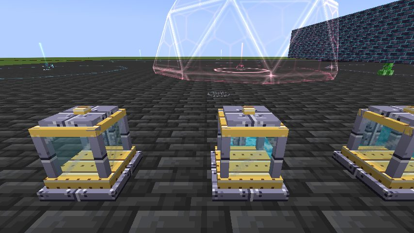<br>*Tanques de mana com 0%, 50% e 100%.* |
| 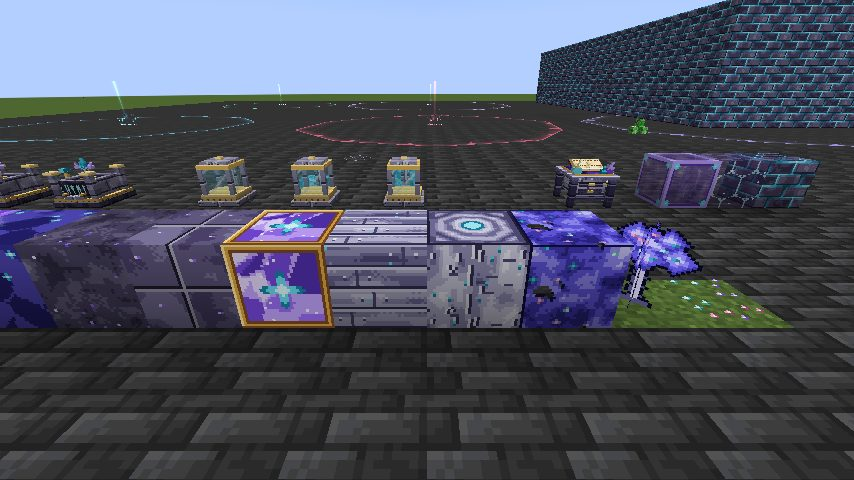<br>*Blocos do geodo, madeira arcana, folhas e pétalas.* | |

## Como jogar (o essencial)

1. Encontre um **geodo arcano** (subterrâneo) e colha os **cristais**.
2. Faça o **Moedor Arcano** e transforme cristais em **poeira arcana** e nas demais poeiras (receitas de moagem).
3. Use a poeira arcana sobre um bloco firme para criar um **sigilo**; jogue outras poeiras nele para definir a proteção.
   Agachado, role o mouse sobre o sigilo para escolher entre as proteções possíveis.
4. Coloque um **Tanque de Mana** ao lado (ou use a sua própria mana) para pagar a manutenção.
5. Ative o sigilo e veja o campo surgir. Guarde a proteção num **pergaminho** na Bancada de Inscrição.

O **Codex do Selarium** dentro do jogo explica cada sistema.

## Compilar e testar

Requisitos: **JDK 17**. O projeto usa ForgeGradle 6 / Forge 47.4.20.

```bash
./gradlew build              # gera build/libs/selarium-<versão>.jar
./gradlew runClient          # cliente de desenvolvimento
./gradlew runServer          # servidor dedicado
./gradlew runGameTestServer  # testes headless (registries, receitas, worldgen, mana, proteções)
./gradlew runClient -Psmoketest  # sessão de cliente roteirizada que tira capturas de tela (precisa de OpenGL)
```

No Windows use `gradlew.bat`. Configurações geradas: `config/selarium-common.toml` (jogabilidade, servidor) e
`config/selarium-client.toml` (efeitos visuais, HUD).

O GitHub Actions ([`.github/workflows/build.yml`](.github/workflows/build.yml)) valida os assets, compila, empacota,
roda os GameTests e um **teste de fumaça do cliente** (o jogo de verdade, com OpenGL por software) a cada push. Este
último cria um mundo, monta uma vitrine com sigilos ativos e máquinas, abre as telas e anexa as capturas ao run.

## Estrutura

Veja [docs/ARCHITECTURE.md](docs/ARCHITECTURE.md). Resumo:

```
src/main/java/com/seleris/selarium/
  ward/            proteções: definições, área, custos, eventos e efeitos (ward/effect/<categoria>)
  sigil/ block/ blockentity/   sigilo, máquinas e seus dados
  dust/ grinder/ inscription/  poeiras, moagem e inscrição de pergaminhos
  mana/ progression/ grimoire/ mana do jogador, marcos e regras de alvo
  client/          renderers, partículas, HUD e telas (somente cliente)
  particle/ registry/ network/ config/  infraestrutura comum
src/main/resources/  assets (modelos, texturas, lang) e data (receitas, loot, worldgen)
tools/               pipeline de arte, validadores, pré-visualização de modelos, gerador de docs
docs/                arquitetura, identidade visual, balanceamento, checklist de testes
```

## Ferramentas

| Ferramenta | Uso |
|---|---|
| `python3 tools/art/build_all.py` | Regenera **todas** as texturas, glifos, sprites de VFX e modelos JSON (determinístico). Requer `pip install pillow numpy`. |
| `python3 tools/validate_assets.py` | Confere modelos, blockstates, texturas, sons, receitas, loot tables e traduções. |
| `node tools/preview/render.cjs …` | Renderiza modelos JSON num PNG (Chromium + three.js) para revisar o visual sem abrir o jogo. |
| `python3 tools/gen_docs.py` | Regenera [docs/WARDS.md](docs/WARDS.md) a partir do código. |
| `python3 tools/check_server_log.py` | Falha se o log do servidor tiver erros relevantes (usado no CI). |
| `python3 tools/dump_smoke.py run` | Relata o teste de fumaça do cliente e imprime as capturas (base64) no log do CI. |

## Licença

Todos os direitos reservados (veja `mods.toml`).
