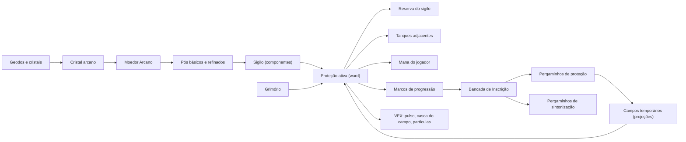
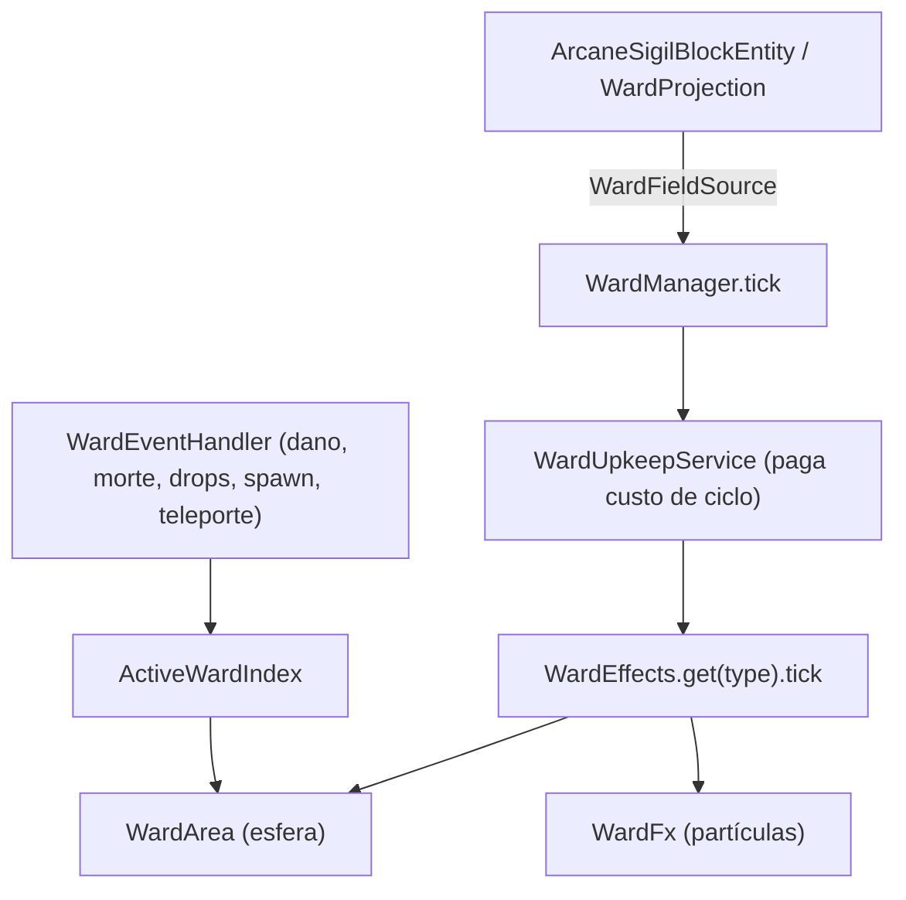

# Arquitetura do Selarium

Mod Forge para **Minecraft 1.20.1** (Java 17). Mod id: `selarium`.

## Como os sistemas se conectam

## Pacotes

| Pacote | Responsabilidade |
|---|---|
| `registry/` | `DeferredRegister`s: blocos, itens, block entities, menus, receitas, sons, partículas, features, abas criativas. |
| `block/`, `blockentity/` | Sigilo, Moedor, Tanque, Bancada, cristais, blocos temporários. O sigilo guarda dono, componentes, ward, mana, duração, recarga e estado ativo. |
| `dust/`, `grinder/` | 10 tipos de poeira (básica/refinada) e as receitas de moagem (`data/selarium/recipes/arcane_grinding`). |
| `sigil/` | Interação com o sigilo: soltar poeira, seleção de proteção, menu. O servidor valida tudo. |
| `ward/` | Núcleo das proteções (abaixo). |
| `mana/` | Capability de mana do jogador: atual/máxima, experiência, regeneração, nível desbloqueado. |
| `progression/`, `inscription/` | Marcos (1 000 / 2 500 / 5 000 / 10 000 de mana), `SavedData` de progresso e a Bancada de Inscrição. |
| `grimoire/` | Regras por jogador, por categoria de criatura e por proteção; almas conhecidas. |
| `worldgen/` | Geodos arcanos, árvore arcana e pétalas. |
| `network/` | Canal `SimpleChannel`: mana, grimório, projeções, pré-visualização. |
| `particle/` | `GlowParticleOptions`/`GlowParticleType` (partículas coloridas enviadas pelo servidor). |
| `client/` | Somente cliente: renderers (sigilo, tanque), `vfx/` (casca do campo, render types), `particle/`, HUD, telas. |
| `client/dev/` | `ClientSmokeTest`: piloto de cliente para o CI (inerte sem `-Dselarium.smoketest`). Cria um mundo, monta uma vitrine, abre as telas e tira capturas. |
| `config/` | `SelariumCommonConfig` (jogabilidade) e `SelariumClientConfig` (efeitos visuais). |
| `gametest/` | GameTests do Forge executados no CI. |

## O núcleo `ward/`

- **`WardType`** – os 32 ids (mais `NONE`). O nome serializado faz parte do formato de save: não renomeie.
- **`WardDefinitions`** – requisitos de poeira, prioridade, custos, duração, recarga, intervalo e alcance de cada proteção.
- **`WardEffects`** – *registry* `WardType → IWardEffect`. Cada proteção é uma classe pequena em
  `ward/effect/<categoria>/`. As configuradas por `MvpWardConfig` herdam de `ConfiguredWardEffect` (que trata do
  interruptor `enabled`). As guiadas por eventos usam `PassiveWardEffect` e vivem em `WardEventHandler`.
- **`WardArea`** – **todas** as consultas de entidades/blocos usam a mesma esfera que o cliente desenha.
- **`WardStyles`** – categoria, cores e estilo de casca de cada proteção (compartilhado servidor/cliente).
- **`WardFx`** – helpers de VFX do servidor (pulso, toque, explosão, trilha) via `ServerLevel#sendParticles`.
- **`ActiveWardIndex`** – índice estático dos campos ativos, limpo ao parar o servidor.
- **`WardProjection`** – campo temporário de pergaminho (sem block entity); compartilha `WardFieldSource`.

## Visual (cliente)

- **`ArcaneSigilRenderer`** desenha, de baixo para cima: círculo de giz → marcas de poeira → glifo → anéis de luz → runas em
  órbita → cristal-foco → feixe de luz → casca do campo. Tudo em texturas brancas tingidas por cor (ward/poeira).
- **`WardShellRenderer`** desenha o anel no chão e a casca (esfera com opacidade máxima na silhueta e perto do observador;
  estilos `SOFT`, `HEX`, `RUNES`). Campos de pergaminho são desenhados por `ProjectionShellEvents`.
- **Partículas**: `wisp`, `spark`, `rune` e `ring` (anel plano que se expande). Descritores em `assets/selarium/particles`.
- **Configuração**: `config/selarium-client.toml` → `vfxQuality` (OFF/LOW/MEDIUM/HIGH), `wardShells`, `shellOpacity`…
- **Blend aditivo**: `SelariumRenderTypes.additive` usa `LIGHTNING_TRANSPARENCY` (`SRC_ALPHA, ONE`). O
  `ADDITIVE_TRANSPARENCY` do vanilla é `ONE, ONE` e **ignora o alfa**: uma textura branca com alfa vira um retângulo
  sólido. Toda textura de brilho é branca + alfa e depende disso.
- **Teste visual**: o job `client-smoke` do CI sobe o jogo de verdade e anexa capturas de tela ao run (veja
  `docs/BUILD_NOTES.md`); é a forma de conferir renderers, partículas e telas sem uma GPU.

## Pipeline de arte

Todos os assets visuais gerados ficam em `tools/art` (Python + numpy/Pillow) e são **determinísticos**:

| Módulo | Gera |
|---|---|
| `blocks.py` | texturas dos blocos naturais (geodo, cristais, madeira lunar, folhas…) |
| `materials.py` | materiais tileáveis das máquinas (pedra ritual, metal, dourado, vidro, couro, pergaminho) |
| `machines.py`, `item_models.py`, `data_assets.py` | modelos JSON multi-elemento (via DSL `models.py`) |
| `items.py`, `covers.py` | sprites de itens, capas de livros, selos |
| `sigil.py` | 32 glifos, marcas de poeira e anéis rotativos (vetorial, 256 px) |
| `vfx.py` | partículas, casca hexagonal, faixa de runas, feixe, fluido de mana |
| `walls.py` | texturas animadas da Muralha e da Barreira Tangível |

Para revisar um modelo sem abrir o jogo: `node tools/preview/render.cjs --out out.png block/arcane_grinder`.
